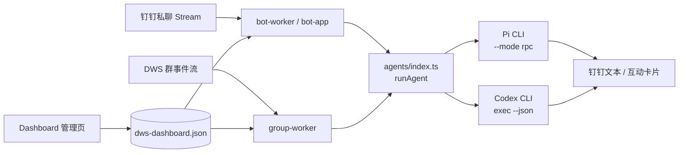
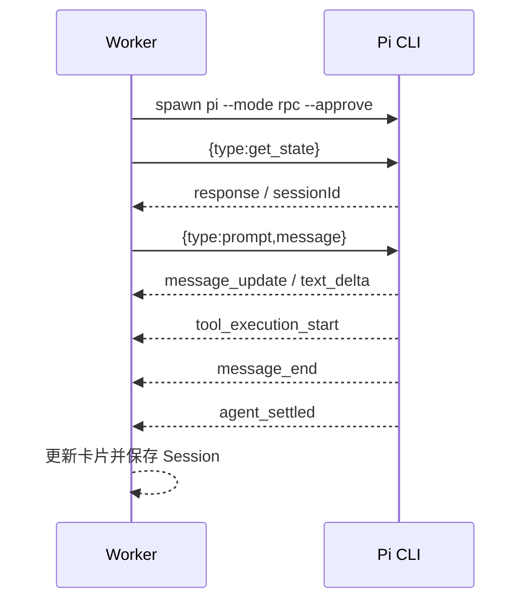
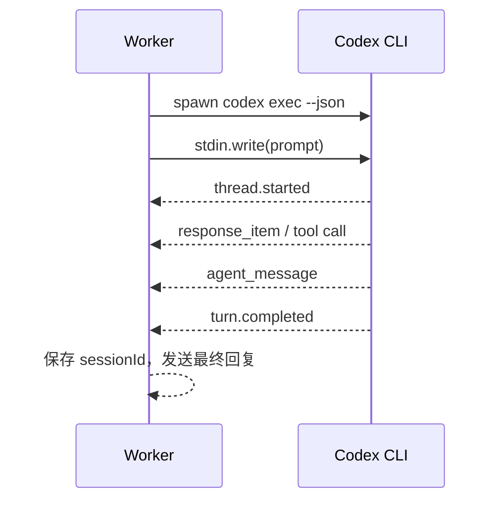
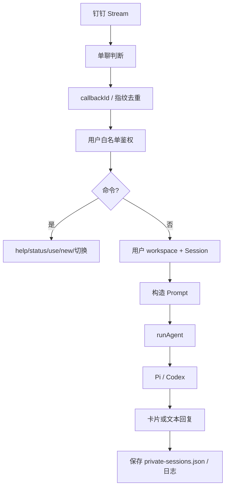
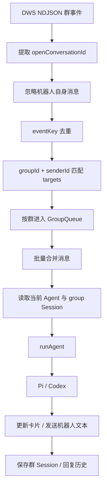
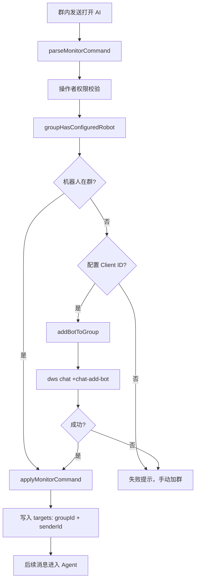
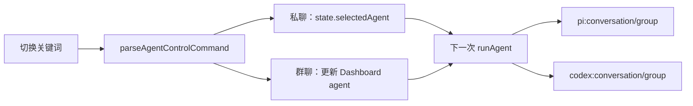

# oh-my-im 分享图集

## 1. 系统总体架构

```mermaid
flowchart LR
  DT[钉钉私聊 Stream] --> BOT[bot-worker / bot-app]
  DWS[DWS 群事件流] --> GROUP[group-worker]
  DASH[Dashboard 管理页] --> CFG[(dws-dashboard.json)]
  CFG --> BOT
  CFG --> GROUP
  BOT --> ROUTER[agents/index.ts\nrunAgent]
  GROUP --> ROUTER
  ROUTER --> PI[Pi CLI\n--mode rpc]
  ROUTER --> CODEX[Codex CLI\nexec --json]
  PI --> REPLY[钉钉文本 / 互动卡片]
  CODEX --> REPLY
```

## 2. Pi RPC 通信

```mermaid
sequenceDiagram
  participant W as Worker
  participant P as Pi CLI
  W->>P: spawn pi --mode rpc --approve
  W->>P: {type:get_state}
  P-->>W: response / sessionId
  W->>P: {type:prompt,message}
  P-->>W: message_update / text_delta
  P-->>W: tool_execution_start
  P-->>W: message_end
  P-->>W: agent_settled
  W-->>W: 更新卡片并保存 Session
```

## 3. Codex JSONL 通信

```mermaid
sequenceDiagram
  participant W as Worker
  participant C as Codex CLI
  W->>C: spawn codex exec --json
  W->>C: stdin.write(prompt)
  C-->>W: thread.started
  C-->>W: response_item / tool call
  C-->>W: agent_message
  C-->>W: turn.completed
  W-->>W: 保存 sessionId，发送最终回复
```

## 4. 私聊流程

```mermaid
flowchart TD
  A[钉钉 Stream] --> B[单聊判断]
  B --> C[callbackId / 指纹去重]
  C --> D[用户白名单鉴权]
  D --> E{命令?}
  E -->|是| F[help/status/use/new/切换]
  E -->|否| G[用户 workspace + Session]
  G --> H[构造 Prompt]
  H --> I[runAgent]
  I --> J[Pi / Codex]
  J --> K[卡片或文本回复]
  K --> L[保存 private-sessions.json / 日志]
```

## 5. 群聊流程

```mermaid
flowchart TD
  A[DWS NDJSON 群事件] --> B[提取 openConversationId]
  B --> C[忽略机器人自身消息]
  C --> D[eventKey 去重]
  D --> E[groupId + senderId 匹配 targets]
  E --> F[按群进入 GroupQueue]
  F --> G[批量合并消息]
  G --> H[读取当前 Agent 与 group Session]
  H --> I[runAgent]
  I --> J[Pi / Codex]
  J --> K[更新卡片 / 发送机器人文本]
  K --> L[保存群 Session / 回复历史]
```

## 6. 打开 AI 与自动拉群

```mermaid
flowchart TD
  A[群内发送打开 AI] --> B[parseMonitorCommand]
  B --> C[操作者权限校验]
  C --> D[groupHasConfiguredRobot]
  D --> E{机器人在群?}
  E -->|是| H[applyMonitorCommand]
  E -->|否| F{配置 Client ID?}
  F -->|否| G[失败提示，手动加群]
  F -->|是| I[addBotToGroup]
  I --> J[dws chat +chat-add-bot]
  J --> K{成功?}
  K -->|否| G
  K -->|是| H
  H --> L[写入 targets: groupId + senderId]
  L --> M[后续消息进入 Agent]
```

## 7. Agent 切换与 Session

```mermaid
flowchart LR
  MSG[切换关键词] --> PARSE[parseAgentControlCommand]
  PARSE --> PRIVATE[私聊：state.selectedAgent]
  PARSE --> GROUP[群聊：更新 Dashboard agent]
  PRIVATE --> ROUTE[下一次 runAgent]
  GROUP --> ROUTE
  ROUTE --> PI[pi:conversation/group]
  ROUTE --> CX[codex:conversation/group]
```
